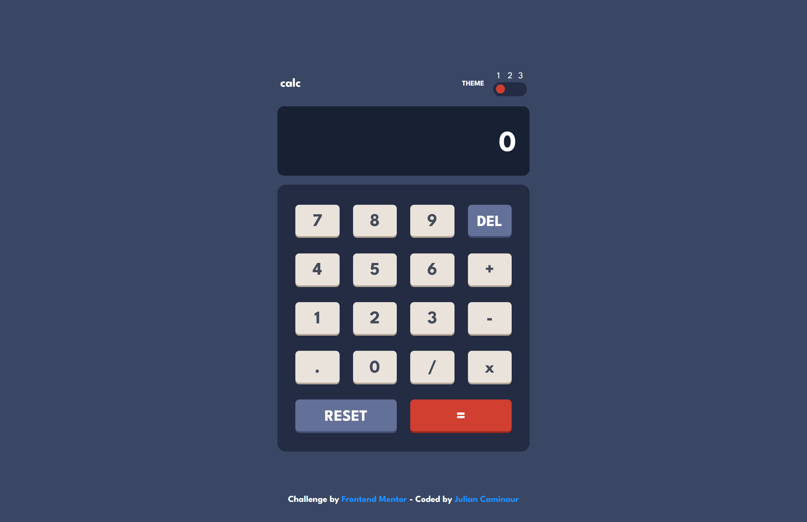

# Frontend Mentor - Calculator app solution

This is a solution to the [Calculator app challenge on Frontend Mentor](https://www.frontendmentor.io/challenges/calculator-app-9lteq5N29). Frontend Mentor challenges help you improve your coding skills by building realistic projects.

## Table of contents

- [Overview](#overview)
  - [The challenge](#the-challenge)
  - [My Solution](#my-solution)
  - [Links](#links)
- [My process](#my-process)
  - [Built with](#built-with)
  - [What I learned](#what-i-learned)
  - [Continued development](#continued-development)
  - [Useful resources](#useful-resources)
- [Author](#author)

**Note: Delete this note and update the table of contents based on what sections you keep.**

## Overview

### The challenge

Users should be able to:

- See the size of the elements adjust based on their device's screen size
- Perform mathmatical operations like addition, subtraction, multiplication, and division
- Adjust the color theme based on their preference
- **Bonus**: Have their initial theme preference checked using `prefers-color-scheme` and have any additional changes saved in the browser

### My Solution

#### Desktop

#### Mobile

### Links

- Live Site URL: [Live Site](https://julian-caminaur-calculator-challenge.netlify.app/)
- Solution Repository: [Github](https://github.com/Caminaur/Frontend-Mentor---Calculator-app)

## My process

### Built with

- Semantic HTML5 markup
- CSS custom properties
- Flexbox
- Javascript
- React

### What I learned

I found the approach to handling the style switcher quite interesting, especially utilizing the prefers-color-scheme preference.

### Continued development

Moving forward, I want to focus more on planning when working on projects that involve complex logic.

### Useful Resources

- [React](https://react.dev/) – React made it easier to manage the UI dynamically, especially when handling state changes and rendering components efficiently.
- [ChatGPT](https://openai.com/chatgpt) – ChatGPT was useful for troubleshooting issues, and explaining complex concepts in a simple way.

## Author

- [Website](https://julian-caminaur.tech/)
- [Frontend Mentor](https://www.frontendmentor.io/profile/Caminaur)
- [CSS Battle](https://cssbattle.dev/player/caminaur)
- [Exercism](https://exercism.org/profiles/Caminaur)
